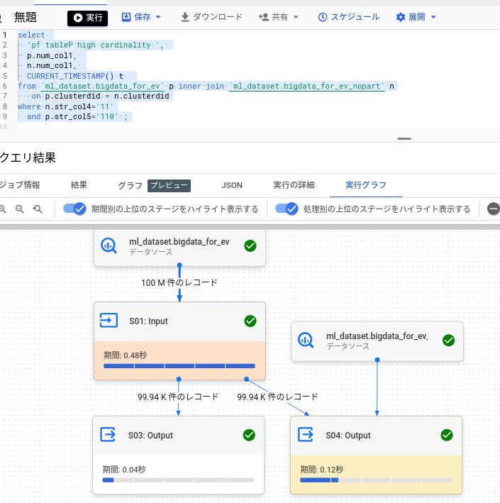

# Bigqueryの統計情報のクエリプランへの影響の検証
<br><br>
# ##概要
DWH系のDBはマシンパワーに依存する。クエリプランはパーティションやクラスタキーに
よってのみ決まる製品もある。
一方、多くのRDBはオプティマイザが統計情報からデータ傾向を把握し、緻密なクエリプラン
を作成する。
Bigqueryはどの程度、統計情報を考慮してクエリプランを決めているのか検証する。


<br><br>
# ##環境＆手順

## テストデータ
以下のリポジトリの方法で作成した1億件のテーブルで性能を検証する。

[Bigqueryで大量データ生成](https://github.com/data2coordi/pub_bigquery_generate_data)

## 性能確認手順

```
bq query --use_legacy_sql=false <  pf.sql

```

[対象のSQL:pf.sql](./pf.sql)

上記のコマンドで対象のSQL実行を実行する。
クエリプランを取得する場合は、Bigqueryのコンソールから上記SQLを実行する。


<br><br>
# ##検証
## 検証1：Bigqueryは項目の最大値、最小値を把握しているのか？
### 検証内容
パーティション、クラスターキー以外の通常項目で以下2パターンの条件指定の結果を
検証する。

***パターン1:最小値と最大値の間にある値をwhere句に指定する。***

***パターン2:対象項目に含まれるデータの最小値より小さい、または最大値より大きい値をwhere句に指定する。***

<br><br>
### 検証結果

***データ傾向***

```
select 
	count(num_col1) num_col1_count, 
	min(num_col1) num_col1_min, 
	max(num_col1) num_col1_max
	from `ml_dataset.bigdata_for_ev`; -- at [2:1]
+----------------+--------------+--------------+
| num_col1_count | num_col1_min | num_col1_max |
+----------------+--------------+--------------+
|      100003248 |            1 |     99999999 |
+----------------+--------------+--------------+
```

<br><br>

***パターン1:最小値と最大値の間にある値をwhere句に指定する。***

フルスキャンで全データをREADしている。この条件句はヒットしないのでSQLの結果は0件。


<br><br>

***パターン2:対象項目に含まれるデータの最小値より小さい、または最大値より大きい値をwhere句に指定する。***

スキャンをしていない（0件の読み込み）。この条件句はヒットしないのでSQLの結果は0件。


<br><br>
### 考察 
最小値、最大値を把握していて、クエリプランの作成に利用しているようである。
最小値〜最大値の外の値を条件指定した場合は、ヒットしないことは明らかなのでデータを全くスキャンしない。


<br><br>
## 検証2：Bigqueryは項目のカーディナリティを知っているのか？
### 検証内容
RDBのJOINではカーディナリティが高い条件を指定したテーブルが駆動表となる。

※まず高いカーディナリティで絞り込みJOIN対象レコードをなるべく小くするため

これが可能なのは統計情報から項目のカーディナリティをオプティマイザがわかるからである。
Bigqueryでは特に統計情報を利用者が意識しない。Bigqueryではカーディナリティは考慮されないのか
検証する。


<br><br>
### 検証結果

***事前にデータ傾向を確認***

下記のとおりbigdata_for_evテーブル（以降、テーブルPと呼ぶ）では、
str_col3(10種類の値）よりもstr_col4(100種類の値）の方がカーディナリティが高い
str_col3、str_col4ともパーティションキーでもクラスターキーでもなく、通常の項目である。

```
select 
	count(*) count, 
	min(str_col3) str_col3_min, 
	max(str_col3) str_col3_max,
	min(str_col4) str_col4_min, 
	max(str_col4) str_col4_max
	from `ml_dataset.bigdata_for_ev`; -- at [2:1]
+-----------+--------------+--------------+--------------+--------------+
|   count   | str_col3_min | str_col3_max | str_col4_min | str_col4_max |
+-----------+--------------+--------------+--------------+--------------+
| 100003248 | 0            | 9            | 0            | 99           |
+-----------+--------------+--------------+--------------+--------------+

```
下記のとおりbigdata_for_evテーブル（以降、テーブルNと呼ぶ）でも同様に、
str_col3(10種類の値）よりもstr_col4(100種類の値）の方がカーディナリティが高い
```
select 
	count(*) count, 
	min(str_col3) str_col3_min, 
	max(str_col3) str_col3_max,
	min(str_col4) str_col4_min, 
	max(str_col4) str_col4_max
	from `ml_dataset.bigdata_for_ev_nopart`; -- at [10:1]
+-----------+--------------+--------------+--------------+--------------+
|   count   | str_col3_min | str_col3_max | str_col4_min | str_col4_max |
+-----------+--------------+--------------+--------------+--------------+
| 100003248 | 0            | 9            | 0            | 99           |
+-----------+--------------+--------------+--------------+--------------+
```

Bigqueryのプロファイル機能でもカーディナリティを確認しておく。


str_col3は棒グラフから概ね10％がヒットするカーディナリティとなっている。
一方、str_col4は1%がヒットするカーディナリティ。


<br><br>

***パターン1:テーブルPにカーディナリティが高い条件を指定した場合のクエリプラン。***

下記のとおりテーブルPが駆動表となっている。
カーディナリティが高いテーブルからアクセスする基本どおりのクエリプラン。
```

--実行したSQL
select 
	'pf tableP high cardinality ', 
	p.num_col1, 
	n.num_col1, 
	CURRENT_TIMESTAMP() t  
from `ml_dataset.bigdata_for_ev` p inner join `ml_dataset.bigdata_for_ev_nopart` n
   on p.clusterdid = n.clusterdid
where n.str_col3='1'
  and p.str_col4='1' ; -- < テーブルPでカーディナリティが高い項目を条件指定

```


<br><br>
***パターン2:テーブルNにカーディナリティが高い条件を指定した場合のクエリプラン。***

下記のとおりテーブルNが駆動表に変わった。
やはり、カーディナリティが高いテーブルからアクセスする基本どおりのクエリプラン。
```
--実行したSQL
select 
	'pf tableN high cardinality ', 
	p.num_col1, 
	n.num_col1, 
	CURRENT_TIMESTAMP() t  
from `ml_dataset.bigdata_for_ev` p inner join `ml_dataset.bigdata_for_ev_nopart` n
   on p.clusterdid = n.clusterdid
where p.str_col3='1' 
  and n.str_col4='1' ;-- < テーブルNでカーディナリティが高い項目を条件指定

```


<br><br>
### 考察
Bigqueryはカーディナリティを知っている。
RDBでは一般的にインデックス項目で統計情報を取得することが多いが、
Bigqueryは通常項目でも統計情報を持っているようである。いつ統計情報を収集しているのか。。。


<br><br>
## 検証3：Bigqueryは項目のカーディナリティが低い(ヒット件数が多い）値を知っているのか？
### 検証内容
DB製品によっては、カーディナリティが低い値を統計情報として収集している。

※ 負荷を考慮してインデックス項目毎に上位10値ぐらいを収集することが多い。

Bigqueryも収集してクエリプラン作成に利用しているか確認する。

<br><br>
### 検証結果

***事前にデータ傾向を確認***

bigdata_for_evテーブル、bigdata_for_ev_nopartテーブルともstr_col5は値の内50％が10(異常値)である。

※ 下記SQLで事前に50％が10となるようにupdateした。もともとは0〜999が均等に存在した。
```
update `ml_dataset.bigdata_for_ev` set str_col5 = '10' where str_col5  > '500';
update `ml_dataset.bigdata_for_ev_nopart` set str_col5 = '10' where str_col5  > '500';
```
下記はプロファイル機能でみたカーディナリティ。
str_col4よりもstr_col5の方がカーディナリティは10倍高い。
しかし10が異常値で、もしwhere句で10が指定されると50％がヒットしてしまう。


<br><br>

***パターン1:str_col5に通常値を条件指定した場合***

セオリー通りカーディナリティが高いstr_col5が条件指定されたテーブルPが駆動表となっている。




<br><br>

***パターン2:str_col5に異常値を条件指定した場合***

str_col5:10は異常値で50％がヒットしてしまうので、
カーディナリティは低くてもテーブルN.str_col4での絞り込みから駆動している。


<br><br>

### 考察
Bigqueryはカーディナリティが低い値を知っている。
実は、updateでデータを更新した直後は異常値10を指定してもstr_col5の絞り込みから
駆動するクエリプランであった。
異常値を発生させるupdate実行から1分程度経過してから上記のように異常値の指定が考慮されはじめた。
データ更新後、1分程度で統計情報を収集していると思われる。

データの更新により急に上記のような異常値が発生し、障害に発展することは
現場で常に起こっている。
しかし、1分以内で統計情報が反映させるなら安心できる。
（データ量によると思いますが）


